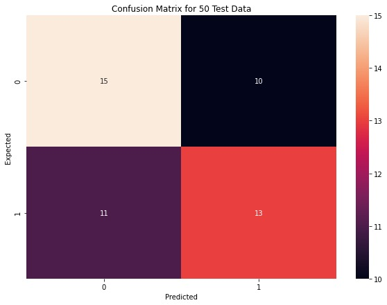
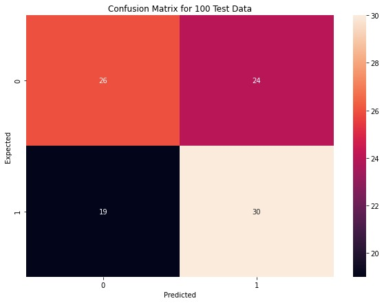
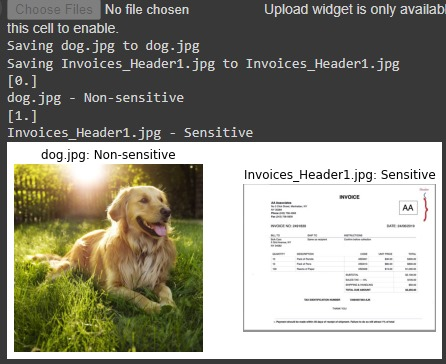
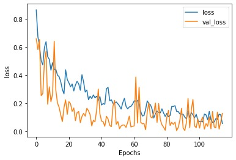

# Trust Chain - Quantathon 2.0
-------------------------------------------------------------------------------------------------------
## Tagline
Decentralized content moderation for a safer social media experience.

## Problem Statement
In an era where user-generated content dominates social media, moderation is crucial to ensure adherence to community guidelines and legal standards. Traditional systems face challenges like bias in decision-making, lack of transparency, scalability issues, and limited user input. Our project addresses these issues through an innovative approach combining AI, decentralization, and blockchain technology.

## Proposed Solution
Our solution enhances content moderation by:
- **AI-Based Moderation:** Automatically reviewing and flagging content using AI algorithms based on community-defined rules.
- **Decentralized Review:** Distributing moderation responsibilities across a network of nodes to prevent central control and bias.
- **Blockchain Transparency:** Recording all moderation actions on a blockchain for an immutable and transparent ledger.
- **Community Involvement:** Enabling users to vote on content moderation guidelines, ensuring community values shape the rules.

## Approach
Our innovative approach includes:
- **AI-Driven Moderation:** Automated content review to reduce bias.
- **Decentralized Governance:** Community-defined moderation policies.
- **Blockchain Transparency:** Immutable record of moderation actions.
- **Community Feedback Loops:** User input for guideline improvement.

## Technologies Used
- **AI Tech Stack:** React.js, Python, Django, TensorFlow, SpaCy/NLTK, MongoDB
- **Blockchain Tech Stack:** Ethereum, Solidity, Web3.js/Ethers.js, MetaMask

## Workflow


## PowerPoint Presentation
You can view the project presentation [here](./snapshots/Quantathon(Nerd%20ninjas).pdf).

## Challenges Faced
During development, we encountered several challenges, including [specific bugs or hurdles you faced]. To overcome these, we [explain your solution or workaround]. 

## Team Experience
Working on this project provided us with valuable experience in [describe what you learned or the skills you gained]. We improved our knowledge in AI and blockchain integration, as well as teamwork and project management skills.

## Getting Started
To run this project locally, follow these steps:


# Social Media

-------------------------------------------------------------------------------------------------------------------------------

## Introduction
*Trust Chain Quantathon 2.0* is a decentralized application built by the *Nerd Ninjas* team for the Quantathon competition. The project integrates blockchain technologies, a responsive frontend, and a secure backend to provide a full-stack solution that emphasizes transparency, decentralization, and security.

## Features
- *Decentralized Data Management*: Using blockchain for trustless, decentralized data storage.
- *User Authentication*: Secure login and signup functionalities.
- *Real-time Chat*: Communication channel using WebSocket or REST API.
- *User Settings*: Ability to configure and personalize user preferences.
- *Dark Mode*: Toggle between light and dark themes for an enhanced user experience.

## Tech Stack

### Frontend:
- *React.js* with *Chakra UI* for responsive design.
- *Recoil* for state management.
- *React Router* for client-side routing.

### Backend:
- *Node.js* with *Express.js* for server-side functionality.
- *MongoDB* as the database.
- *Authentication*: Custom JWT-based authentication.
- *File Storage*: Storing user data securely.

## Getting Started

Follow the instructions below to set up and run the project on your local machine.

### Prerequisites

You need to have the following installed on your local development environment:
- *Node.js* (v14 or above)
- *npm* (Node package manager)
- *MongoDB* (Running locally or using MongoDB Atlas)

### Installation

1. *Clone the repository*:

   ```bash
   git clone https://github.com/Nerd-Ninjas/Trust-Chain-Quantathon-2.0.git
   ```

   Change into the project directory:

   ```bash
   cd Trust-Chain-Quantathon-2.0
   ```

2. *Install the required dependencies*:

   You need to install dependencies for both the *frontend* and *backend*.

   #### Frontend

   Navigate to the frontend directory:

   ```bash
   cd frontend
   ```

   Install the dependencies:

   ```bash
   npm install
   ```

   #### Backend

   Open a new terminal (or tab) and navigate to the backend directory:

   ```bash
   cd backend
   ```

   Install the backend dependencies:

   ```bash
   npm install
   ```

3. *Configuration*:

   Create a `.env` file in the backend directory and add the following environment variables:

   ```bash
   PORT=5000
   MONGO_URI=your_mongodb_connection_string
   JWT_SECRET=your_jwt_secret_key
   ```

   Replace `your_mongodb_connection_string` with your actual MongoDB connection string and `your_jwt_secret_key` with a secure secret key for JWT authentication.

### Running the Application

To start the application, follow the steps for both the *frontend* and *backend*.

#### Frontend

Navigate to the `frontend` directory and run:

```bash
npm run dev
```

The frontend will run in development mode and can be accessed at `http://localhost:3000`.

#### Backend

In another terminal window/tab, navigate to the `backend` directory and start the server:

```bash
node server.js
```

The backend will run on `http://localhost:5000`.

### Running Both Servers Simultaneously

Make sure that both the frontend and backend servers are running. You can interact with the application via the frontend UI at `http://localhost:3000`.

### Project Structure

```plaintext
Trust-Chain-Quantathon-2.0/
├── frontend/
│   ├── src/            # Frontend React source code
│   ├── public/         # Static public assets
│   └── package.json    # Frontend dependencies
├── backend/
│   ├── controllers/    # Backend controllers for business logic
│   ├── models/         # Mongoose models
│   ├── routes/         # API routes
│   └── server.js       # Express server configuration
└── README.md           # Project documentation
```

### API Endpoints

| HTTP Method | Endpoint          | Description                        |
|-------------|-------------------|------------------------------------|
| POST        | /api/auth/signup   | Sign up a new user                 |
| POST        | /api/auth/login    | Log in an existing user            |
| GET         | /api/user/:id      | Get user details                   |
| GET         | /api/chat          | Fetch chat messages                |
| POST        | /api/chat/send     | Send a new chat message            |

## Contributing

We welcome contributions! To contribute, follow these steps:

1. Fork the repository.
2. Create a new feature branch (`git checkout -b feature-branch`).
3. Commit your changes (`git commit -m 'Add some feature'`).
4. Push to the branch (`git push origin feature-branch`).
5. Open a pull request.

## License

This project is licensed under the MIT License. See the [LICENSE](LICENSE) file for details.

## Project Snapshots


```


# AI Model
-------------------------------------------------------------------------------------------------------
Here’s a "Getting Started" section tailored for the **Image_Classification_model** directory in your AI project, detailing the installation and running commands:

1. **Clone the Repository:**
   ```bash
   git clone https://github.com/Nerd-Ninjas/Trust-Chain-Quantathon-2.0.git
   ```

2. **Navigate to the Project Directory:**
   Change to the **Image_Classification_model** directory:
   ```bash
   cd Trust-Chain-Quantathon-2.0/ai
   ```

3. **Install Required Dependencies:**
   Make sure you have Python and Jupyter Notebook installed. Then, install the necessary libraries. You can create a virtual environment for better dependency management:
   ```bash
   # Create a virtual environment (optional)
   python -m venv env
   # Activate the virtual environment
   # Windows
   .\env\Scripts\activate
   # macOS/Linux
   source env/bin/activate

   # Install required libraries
   ```bash
   pip install tensorflow keras numpy matplotlib
   ```

4. **Run the Jupyter Notebook:**
   Start Jupyter Notebook to open the main notebook for your image classification model:
   ```bash
   jupyter notebook main.ipynb
   ```

5. **Training the Model:**
   Follow the instructions within the Jupyter Notebook to train your image classification model. Make sure to load your dataset and configure the parameters as needed.

6. **View Results:**
   Once the training is complete, view the results using the generated visualizations (e.g., accuracy, loss graphs) and confusion matrices saved in the directory.

   ## Project Snapshots








# Blockchain-review
--------------------------------------------------------------------------------------------------------
To run the image review blockchain project with user authentication for reviewers, follow these steps:

1. **Clone the Repository:**
   ```bash
   git clone https://github.com/Nerd-Ninjas/Trust-Chain-Quantathon-2.0.git
   ```

2. **Install Required Dependencies:**
   Navigate to the **image-review-blockchain** directory and install the necessary packages:
   ```bash
   cd Trust-Chain-Quantathon-2.0/image-review-blockchain
   npm install
   ```

3. **Set Up the Ethereum Network with Ganache:**
   - Launch Ganache and create a new workspace.
   - Make note of the RPC server URL (default is usually `http://127.0.0.1:7545`).

4. **Configure MetaMask:**
   - Install the MetaMask extension in your web browser.
   - Set up a new wallet or import an existing one using the seed phrase.
   - Connect MetaMask to the local Ganache blockchain by adding a new network with the following details:
     - **Network Name:** Ganache
     - **New RPC URL:** `http://127.0.0.1:7545`
     - **Chain ID:** 5777 (or as shown in Ganache)
     - **Currency Symbol:** ETH

5. **Deploy Smart Contracts:**
   - In the **image-review-blockchain** directory, run:
     ```bash
     truffle migrate --network development
     ```

6. **Run the Reviewer Application:**
   - Navigate to the **reviewer** directory:
     ```bash
     cd ../reviewer
     ```
   - Install any required dependencies (if applicable):
     ```bash
     npm install
     ```
   - Start the reviewer application:
     ```bash
     npm start
     ```
## Project Snapshots


1. Clone the repository: `git clone https://github.com/Nerd-Ninjas/Trust-Chain-Quantathon-2.0.git`
2. Install the required dependencies.
3. Set up the Ethereum network with Ganache.
4. Configure MetaMask and connect to the local blockchain.
5. Run the frontend and backend servers.

## License
This project is licensed under the [Apache 2.0 License](LICENSE).

## Contributors
- [Srihari Prasath A](https://github.com/Srihari-Prasath)
- [Naveen Bharathi B](https://github.com/bnaveenbharathi)
- [Sandhosh G](https://github.com/SANDHOSH02)
- [Pranav S](https://github.com/Pranavshiv)
